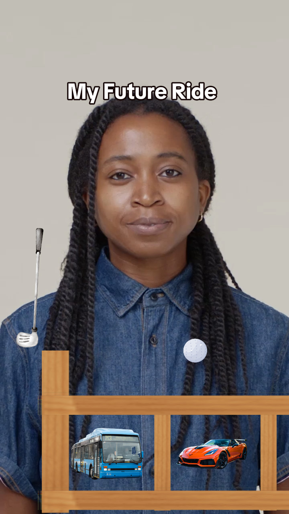
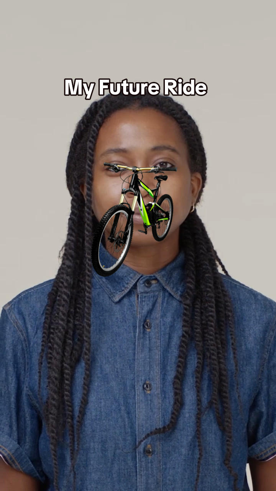

# 🏌️ My Future Ride — TikTok AR Effect

> A physics-based AR game built on **TikTok Effect House** where you swing a golf club to reveal your future vehicle — from a Lamborghini to a donkey! 🚗🫏

---

## 🎮 Gameplay

| State | Description |
|---|---|
| **IDLE** | Golf club and ball are ready. Vehicle shelf is visible. |
| **CHARGING** | Hold the screen — club oscillates between `2.83°` and `275°` |
| **LAUNCH** | Release — club swings back fast, ball launches with mapped X velocity |
| **RESULT** | Ball settles into a slot after 7 seconds — your future ride is revealed! |

---

## 📸 Preview

<table>
  <tr>
    <td align="center"><b>Gameplay — Swing & Launch</b></td>
    <td align="center"><b>Result — Future Ride Revealed</b></td>
  </tr>
  <tr>
    <td></td>
    <td></td>
  </tr>
</table>

---

## 🏗️ Scene Architecture

```
General
├── Scene Object          ← CombinedGameController.ts
├── Camera
│   ├── 2D Text           ← "My Future Ride" title
│   ├── Screen Image
│   └── ball sound hit    ← AudioComponent
│
2D Foreground
└── 2D Camera
    └── Portrait Segmentation
        ├── rides images  ← 15 vehicle sprites
        │   ├── bus, lambo, donkey, Bullet, jeep
        │   ├── chappal, rusted car, scooter, rols
        │   ├── 4x4, toy car, truck, auto, cycle, ericksha
        ├── divider 1-14  ← Physics slot dividers (Box Collider 2D)
        ├── short plank 1 & 2  ← Boundary walls
        ├── long plank 1 & 2   ← Ceiling barriers (long plank 1 hides after 7s)
        ├── golf bat      ← Club sprite (pivoted, rotates on Z axis)
        └── golf ball     ← RigidBody2D + Circular Collider
```

---

## ⚙️ Technical Implementation

### Core Script — `CombinedGameController.ts`

A single TypeScript script handles the entire game loop:

#### Club Swing Mechanic
```typescript
// Hold → oscillate between minAngle and maxAngle
this.currentAngle += this.oscillationDirection * this.oscillationSpeed * deltaTime;

// Release → fast return swing
this.currentAngle -= this.returnSpeed * deltaTime;

// Apply clockwise rotation on Z axis
this.clubTransform.localRotation = APJS.Quaternionf.makeFromAngleAxis(
    angle * (Math.PI / 180),
    new APJS.Vector3f(0, 0, -1)  // negative Z = clockwise
);
```

#### Ball Physics — Velocity Mapped to Swing Angle
```typescript
// Normalize swing angle and map to X velocity
const normalizedAngle = (swingAngle - this.minAngle) / (this.maxAngle - this.minAngle);
const xVelocity = normalizedAngle * this.velocityMultiplier;

// Enable physics and apply velocity
this.ballRigidBody.static = false;
this.ballRigidBody.velocity = new APJS.Vector2f(xVelocity, 0);
```

#### Vehicle Detection by X Position
```typescript
// 15 slots, each 265 units wide from -175 to 3800
private vehicleRanges: number[][] = [
    [-175, 90],    // bus
    [90, 355],     // lambo
    [355, 620],    // donkey
    [620, 885],    // bullet
    [885, 1150],   // jeep
    [1150, 1415],  // chappal
    [1415, 1680],  // rusted car
    [1680, 1945],  // scooter
    [1945, 2210],  // rols
    [2210, 2475],  // 4x4
    [2475, 2740],  // toy car
    [2740, 3005],  // truck
    [3005, 3270],  // auto
    [3270, 3535],  // cycle
    [3535, 3800],  // ericksha
];
```

#### Camera Follow System
```typescript
// Smooth camera follow after ball is launched
const newX = camPos.x + (ballPos.x - camPos.x) * this.cameraFollowSpeed * deltaTime;
const newY = camPos.y + (ballPos.y - camPos.y) * this.cameraFollowSpeed * deltaTime;
this.cameraTransform.localPosition = new APJS.Vector3f(newX, newY, camPos.z);
```

---

## 🎛️ Tunable Parameters (Inspector)

| Parameter | Default | Purpose |
|---|---|---|
| `Oscillation Speed` | 120 | Degrees/sec during hold |
| `Return Speed` | 600 | Degrees/sec on release |
| `Min Angle` | 2.83° | Club rest position |
| `Max Angle` | 275° | Max backswing |
| `Velocity Multiplier` | 100 | Ball force scaling |
| `Camera Follow Speed` | 5 | Smoothness of camera tracking |
| `Camera Zoom Out Scale` | 1 | Zoom level after hit |
| `Plank Hide Delay` | 7s | Ceiling removal timer |
| `Velocity Threshold` | 2 | Ball settle detection |

---

## 🧠 Key Technical Decisions

### Why `onUpdate` for Audio Init?
Effect House requires `AudioComponent` to be initialized in `onUpdate` not `onStart` — the component isn't ready on the first frame.

```typescript
// ✅ Correct pattern
if (!this.hitAudioInitialized && this.hitSoundPlayer) {
    this.hitAudio = this.hitSoundPlayer
        .getComponent("AudioComponent") as APJS.AudioComponent;
    if (this.hitAudio) this.hitAudioInitialized = true;
}
```

### Why Arrow Functions for Events?
Regular methods lose `this` context in Effect House event callbacks:
```typescript
// ✅ Arrow function — this context preserved
private onTouchDown = (event: APJS.IEvent) => { ... };

// ❌ Regular method — this breaks
private onTouchDown(event: APJS.IEvent): void { ... }
```

### Input Locking After Ball Hit
```typescript
// Prevent multiple swings after ball is launched
if (!this.isPlaying || this.isReleasing || this.isBallHit) return;
```

### No Array Constructor — Sandbox Restriction
```typescript
// ❌ Blocked by Effect House sandbox
new Array(10).fill(false);

// ✅ Use loops instead
for (let i = 0; i < 10; i++) { this.flags[i] = false; }
```

---

## 🏆 Game Flow

```
RecordStart
    ↓
IDLE — Club ready, shelf visible
    ↓ (Hold screen)
CHARGING — Club oscillates 2.83° ↔ 275°
    ↓ (Release)
LAUNCHING — Fast swing → X velocity applied to ball
    ↓ (7 seconds)
long plank 1 hides → Ball drops into slot
    ↓ (Ball velocity < threshold)
RESULT — Winning vehicle revealed under "My Future Ride"
```

---

## 🛠️ Built With

- **Platform:** TikTok Effect House
- **Language:** TypeScript
- **Physics:** RigidBody2D + Box Collider 2D
- **AR:** Portrait Segmentation
- **Scripting Pattern:** Single combined controller with serialized Inspector references

---

## 👨‍💻 Developer

**Nishan Kandel**
GitHub: [@blackstrom23](https://github.com/blackstrom23)

---

## 📄 License

This project is for educational and portfolio purposes.
Feel free to reference the scripting patterns for your own Effect House projects!
